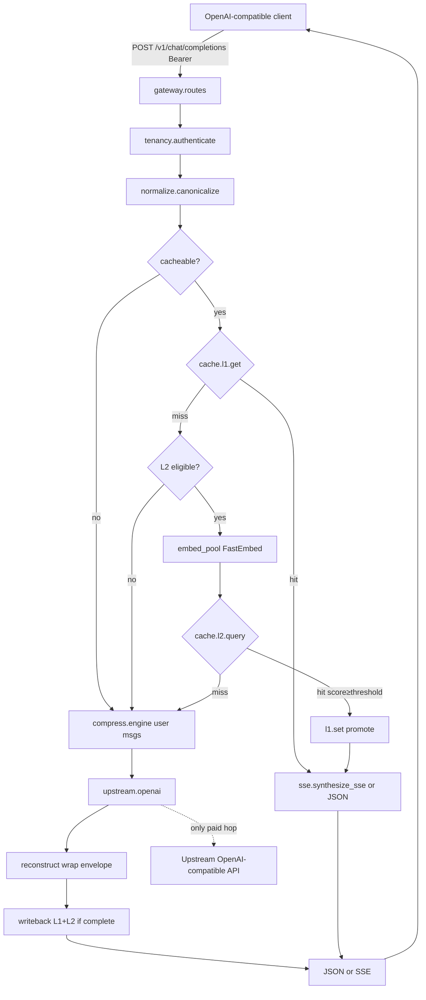
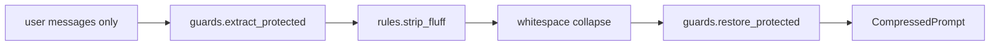

# Cradle Design Document

**Title:** Cradle — local semantic cache and token-compression proxy  
**Author:** Grok (design-doc-writer) for Greg  
**Date:** 2026-09-16  
**Status:** Draft (rev 4 — open questions resolved)  
**Source of truth (product):** `/home/ggrace/coding-projects/cradle/PRD.md`  
**Package name:** `cradle`

---

## Overview

Cradle is an open-source, self-hosted reverse proxy that sits between OpenAI-compatible clients and an upstream LLM API. On every `POST /v1/chat/completions` it (1) looks up an **L1 exact-match cache** by SHA-256 of a closed allowlist of generation-affecting fields, (2) on miss, embeds the prompt locally and queries an **L2 semantic cache** under tenant- and sampling-scoped filters, (3) on miss, **compresses** user-message fluff (guards + regex + whitespace), calls upstream, **wraps** the completion with a local prefix/suffix envelope, and writebacks both layers.

The caching and compression layer uses **only local CPU** (FastEmbed ONNX + process-embedded stores). No Redis or Qdrant daemon in the default deploy, no Ollama, no cloud embed API. Success is empirical: L1 p99 **< 2 ms** for the production `l1.get` (deserialize + validate, no HTTP), L2 p99 **< 25 ms including embed** on a **warm** model for a **single in-flight embed** of a 256–512 token prompt, **≥ 40% token savings on cache misses** against a **documented** golden fixture policy, production hit ratio target **≥ 25%**, **$0.00** external API cost for the cache/compress path.

**FR-3.1 is only partially met in v1.** Reconstruction is a prefix/suffix envelope (brand framing + restored format-instruction lines), not a second local model that rebuilds prose from a dense schema. Structural distillation (`structure.to_dense`) exists as code behind `features.structure` **default off**. Do not claim the PRD’s “small local models to rebuild the user-facing response.”

This document is the v1 implementation contract. Alternatives in the PRD are **locked** here (see **Key Decisions**).

---

## Background & Motivation

LLM API bills and latency are dominated by **repeated or near-repeated prompts**: system prompts, RAG-ish questions, support macros, eval loops. Existing proxies either exact-match only, semantic-cache with **cloud embeddings**, or pull in a god-proxy (LiteLLM) plus Redis plus a vector DB.

The PRD asks for a thin, CPU/edge-deployable middleware: SHA-256 L1, local-vector L2, regex compression on miss, local reconstruction, tenant isolation, versioned invalidation.

**Current state of this repo:** only `PRD.md`. No git, no package, no tests. Greenfield.

**Pain this removes:**

- Recurring queries wait on the upstream instead of **< 2 ms / < 25 ms**. The PRD exec summary says “under 20ms”; the PRD **metrics table** (the binding numeric contract) is L2 **< 25 ms including embed**. v1 implements the table, not the 20 ms headline.
- Verbose prompts pay for filler tokens. Target **≥ 40%** fewer prompt tokens on misses, measured on a documented golden set (not on adversarially padded fixtures).
- Semantic caches that omit tenant filters leak answers across users (LiteLLM documents this).

**Useful local prior art (patterns only):**

- `/home/ggrace/coding-projects/LLMRouter` (NexusGate): OpenAI `ChatRequest` models, Bearer `hmac.compare_digest` in `gateway/middleware/auth.py`, Prometheus counters, JSON `sort_keys` hashing, uvicorn workers=1. `gateway/response.py` **does** set `X-Cache: HIT` on cache hits (steal the idea; Cradle names it `X-Cradle-Cache`). **Do not copy:** god `execute_pipeline` in `gateway/pipeline.py`, Redis-required cache, skip-cache-when-`stream=true` in `gateway/cache/redis_cache.py`, LiteLLM provider.
- `/home/ggrace/coding-projects/llm-orchestration-server`: env-driven settings. **Do not copy:** Ollama daemon; `app/config.py` is a non-pydantic `os.getenv` class.
- `/home/ggrace/coding-projects/inference-innovation-for-local-ai`: `uv` + hatchling + pytest-cov addopts + ruff `target-version = "py312"` / line-length 100. **Steal the tool config, not the layout** (`packages = ["rigbench"]` is not src-layout). Cradle uses `src/cradle/`.

---

## Goals & Non-Goals

### Goals (v1)

| ID | Contract |
| --- | --- |
| G1 | OpenAI-compatible `POST /v1/chat/completions` (stream and non-stream) and `GET /v1/models`. Unknown generation-affecting fields are **forwarded**, not dropped. |
| G2 | L1 exact match: SHA-256 of the canonical hash input (closed allowlist below), **p99 < 2 ms** for production `l1.get` (disk read + JSON decode + `CacheRecord.model_validate`). Excludes HTTP and canonicalize. |
| G3 | L2 semantic match: FastEmbed BGE-small 384-d + in-process Qdrant, cosine **≥ 0.90** default (config allowed **0.88–0.93** per PRD band; **never default or clamp below 0.85**), **p99 < 25 ms including embed** on warm model, 256–512 token prompts, **single in-flight embed**. Queue delay from a busy embed pool is **out of budget** (`stage="embed"` histogram). This budget covers the **cosine + embed** path; the precision guard + cross-encoder rerank added for #5 (Decisions 21–22) add latency on hits and meet 25 ms **only on the GPU rerank path**. |
| G4 | On miss: rule-based **guards + fluff + whitespace** on `role=="user"` messages, **gated by `compress.min_savings_ratio`** (default 0.02 — below-floor requests forwarded uncompressed, #52); **≥ 40% token savings** on the golden fixture suite under the **fixture policy** below (verbose rows clear the floor, so the gate does not lower the aggregate). |
| G5 | Reconstruct as a **prefix/suffix envelope** (brand + format-instruction lines). No second LLM. **Partially satisfies PRD FR-3.1** (layout/brand merge only). |
| G6 | Writeback original-prompt embedding + **reconstructed** response to L1 and L2. TTL **86400 s**. Invalidate on `system_prompt_version` or `pipeline_version` change. |
| G7 | Tenant-scoped keys (`tenant_id` **and** `user_id`). Semantic hits cannot cross users. |
| G8 | Hash signatures include `system_prompt_version` and `pipeline_version`. |
| G9 | Zero cloud API cost for cache/embed/compress. Upstream LLM is the only paid hop, and only on miss. |
| G10 | Prometheus metrics that implement the PRD Token Savings Ratio (not just name it). |
| G11 | Fixture eval harness CI-runnable with a fake upstream (no live LLM). Optional `@pytest.mark.embed` job for real BGE pairs. |
| G12 | Single-process `uv run` on a CPU box; Docker Compose is optional packaging. |

### Non-goals (v1)

- Multi-region, replication, GPU.
- SaaS multi-tenant billing / virtual-key admin UI.
- Native Anthropic/Google APIs (OpenAI-compatible only; adapters later).
- GUI / dashboard beyond `/metrics` and health.
- spaCy NER, llama.cpp 1B style-expansion, cross-encoder rerank. `features.local_1b` is a **load-refuse** hook only (startup error if true without extra). No no-op spaCy/cross-encoder flags.
- Ollama.
- Redis, RocksDB, or a Qdrant **server** process in the default deploy. `l2.mode: server` is a reserved config key; **not implemented in v1**.
- Caching `/v1/embeddings`, `/v1/completions` (legacy), image/audio, `n > 1`.
- Multiple uvicorn workers (v1 is `workers=1`; Qdrant local is not a multi-writer). diskcache process-safety is **not** a license to run workers>1.
- **Fully meeting PRD FR-3.1** (rebuild user-facing answers from compressed completions via local models).
- **`structure.to_dense` on by default.** Flag `features.structure` default **false**.
- Buffering an entire miss-stream before first byte (that is not streaming).

---

## Key Decisions

Locked. Not a menu.

| # | Decision | Choice | Rationale / trade-off |
| --- | --- | --- | --- |
| 1 | Language/runtime | **Python 3.12+ FastAPI + uvicorn**, `uv` / `.venv`, Pydantic v2 | Greg stack default. Solo maintainability. |
| 2 | L1 store | **`diskcache.Cache`** (SQLite+mmap, process-embedded). No Redis. No RocksDB. | Process-safe, native `expire=`, tags. Sub-ms raw GET on SSD; production `get` includes JSON+validate and must still meet <2 ms p99. Redis is a daemon; RocksDB (`rocksdict`) is a native dep with no win at this QPS. |
| 3 | L2 store | **Qdrant local** `QdrantClient(path=...)`. Tests: `:memory:`. | Same API as server later. Payload filters for tenancy + sampling. Official local-mode warning at **20k points** — operational contract, not trivia. |
| 4 | Embeddings | **FastEmbed `BAAI/bge-small-en-v1.5`**, 384-d, CPU ONNX, **no prefix**. | 67 MB, 10–20 ms CPU. Persistent `cache_dir`; library default is `/tmp/fastembed_cache`. |
| 5 | Compression v1 | **Guards + fluff regex + whitespace on user messages only**, gated by benefit: a request whose strip saves < `compress.min_savings_ratio` (default 0.02) is forwarded **uncompressed** (#52), so terse turns pay no cost and G4's ≥40% still holds on the verbose fixture set (they clear the floor easily). `structure.to_dense` behind `features.structure` default **off**. | Honest 40% on a documented verbose-prompt set. Rule-based stripping removes ~0 from terse real traffic while adding a reconstruction pass, so it should not run there. Dense-JSON rewrite without a reconstruct story would immortalize compressed answers. |
| 6 | Local 1B runtime | **`llama-cpp-python` in-process**, extra `cradle[local-1b]`, default **off**. | No Ollama. Extra not in default `uv sync`. |
| 7 | Wire protocol | **OpenAI Chat Completions** `POST /v1/chat/completions` + SSE `text/event-stream` + `GET /v1/models`. | De-facto client contract. `ChatRequest extra="allow"`. |
| 8 | Auth | **Intercept by default.** Empty `auth.keys`: accept any/no Bearer, **forward `Authorization` upstream**, isolate L1/L2 by SHA-256 of that token (or `anon`). Optional `auth.keys` is an allowlist. | Drop-in in front of an existing OpenAI-compatible provider. No Cradle-issued key. |
| 9 | Reconstruction v1 | **Prefix/suffix wrap.** No second LLM. No KV→essay expansion. | Partial FR-3.1. Stream-miss **tees** content; wrap is envelope around already-sent tokens, not a post-hoc rewrite. |
| 10 | L1 canonicalization | **NFKC + selective whitespace + sorted JSON.** Closed generation-affecting allowlist **plus** sorted dump of remaining extras. | Includes `tool_choice`, `n`, `stop`, `seed`, `response_format`, penalties, `logit_bias`, `max_completion_tokens`. `None`/`[]`/`{}` canonicalized. |
| 11 | Process model | **uvicorn `--workers 1`**. | Qdrant local is not a multi-writer. Startup **refuses** if `WEB_CONCURRENCY` / `UVICORN_WORKERS` is set to anything other than `1`. |
| 12 | Streaming cache | **Required in v1.** Hits: `synthesize_sse`. Cacheable misses: wrap-mode tee. `stream+tools` (#43): `_passthrough_cache_stream` — verbatim tee to the client + post-stream cache of no-tool-call responses (gated by `cache.cache_tool_streams`). **Bypass** (`n!=1`, `stream+logprobs`, images): **raw SSE byte passthrough**. Connect failure before body: JSON OpenAI error, not SSE. | Most clients send `stream: true` with tools; bypass must remain a pass-through gateway. |
| 13 | L2 eligibility | **Off when tools non-empty (`[]` counts as empty) or `len(messages) > l2.max_messages` (default 2).** | LiteLLM: semantic cache on agentic/multi-turn replays stale tool calls. **L1 still applies to non-stream tool calls.** `stream=true` **and** tools → **uncacheable** (pass-through; no L1/L2). |
| 14 | Cosine threshold | **Default 0.90.** Config range intended **0.88–0.93**. Clamp **min 0.85**. | PRD: <0.85 → false hits. Optional `@pytest.mark.embed` pair set validates 0.90 against real BGE. |
| 15 | Config format | **YAML file + `CRADLE_*` env overlay** via a custom pydantic-settings source. | YAML is not native; PR 1 implements the source. Secrets only in env. |
| 16 | Package layout | **`src/cradle/`** (src-layout). | Hatchling + uv. |
| 17 | Thread pools | **Dedicated `embed_pool(max_workers=1)` via `loop.run_in_executor`.** L1/L2 KV on the **default** executor. Never `asyncio.to_thread` for ONNX. | `to_thread` uses the default pool; ONNX would stall L1 p99. |
| 18 | `pipeline_version` | **Top-level `settings.pipeline_version` only.** | One path. Hash, L1 tag, L2 payload, `X-Cradle-Pipeline` all read this. |
| 19 | Identity / license | **Local git only. MIT. No GitHub remote until Greg says so. No PyPI.** | `main` + `develop` initialized locally. Do not `git remote add` / `gh repo create` / trusted-publishing. |
| 20 | Default upstream | **`http://127.0.0.1:8080/v1`**. Override `CRADLE_UPSTREAM_BASE_URL`. Optional `upstreams` + `routes` (`fnmatch` on `model`). | One fallback plus named OpenAI-compatible backends (OpenAI, xAI, LiteLLM, llama.cpp). Anthropic `/v1/messages` is not v1. |
| 21 | L2 precision (guard + rerank) | **Cosine recall is not precision.** Two stages gate an L2 hit before serving (#5): a cheap numbers/negation guard, then a `BAAI/bge-reranker-base` cross-encoder (`features.l2_rerank`, default **on**), both **fail forward to a real miss**; rerank **fails open** on model error. Reject is observable (`X-Cradle-Guard`, `X-Cradle-Rerank`). | A bi-encoder scores "capital of France/Germany" ≥ 0.90 and served the wrong cached answer. The guard catches number/negation swaps the reranker is blind to; the reranker catches entity swaps the guard is blind to. **Residual gap:** antonym swaps (closest/farthest) and negation edges score in the paraphrase range — no cosine or rerank threshold separates them; a cross-encoder is not an NLI model. |
| 22 | Rerank latency budget + GPU deploy | **On CPU the reranker breaks the G3 25 ms L2 p99 budget** (~15–40 ms/hit for bge-reranker-base). `l2.rerank_device: cuda` restores it (~2–5 ms) but is a **separate image**, not just a config flag (#31): `onnxruntime-gpu` 1.30 needs CUDA 13.0 + cuDNN 9.x libs (per the onnxruntime CUDA-EP docs; 1.27+ PyPI wheels ship CUDA 13) that `python:3.12-slim` lacks, and it REPLACES the CPU `onnxruntime` (they conflict). So the GPU path is `docker/Dockerfile.gpu` (`nvidia/cuda:13.0.1-cudnn-runtime` base, `uv sync --extra rerank-gpu --no-install-package onnxruntime`) + `docker-compose-gpu.yml` (a standalone template that grants the GPU via `gpus: all` and sets `rerank_device=cuda`). `cuda` on the CPU image fails fast at startup with an actionable error (`rerank.py` checks `CUDAExecutionProvider` presence) instead of the raw fastembed `ValueError`. Accepted: correctness over the CPU latency target; the budget in **G3 applies to the cosine+embed path**, and is met with rerank on **only on a GPU host**. | The 25 ms figure predates the FP fix. Serving a wrong answer fast is worse than a correct answer in 40 ms — still ~200× under a 5–10 s upstream miss. CPU default keeps the thin deploy; GPU is the opt-in path back under budget. A config option with no runnable deploy path (the pre-#31 state) is worse than no option. |
| 23 | Verified L2 (audit sampling) | **Off the critical path, opt-in** (`l2.audit_rate`, default 0). A sampled served L2 hit is re-asked upstream in a background task; the fresh answer is judged against the served one by the loaded cross-encoder (`audit_judge: auto`, `audit_rerank_threshold` 4.0 — measured: same answers ≥ 7.2, contradictory ≤ 2.1) with answer-embedding cosine as the weak fallback (`audit_embed_threshold` 0.90; cosine cannot separate contradictions). Raw score and judge are always logged. Verdicts feed `cradle_l2_audit_total{verdict}`, `{data_dir}/audits.jsonl`, and a per-entry **monotone floor** (`CacheRecord.audit_floor`: judged wrong at similarity `s` ⇒ refuse matches ≤ `s`). Disagree also writes the fresh answer under the query's key. | Static thresholds have no production measurement of wrong hits (vCache, arXiv 2502.03771, learns per-entry thresholds by exploring; Krites, arXiv 2602.13165, verifies asynchronously). The floor is the non-parametric, cold-start-free cousin of vCache's sigmoid fit. Cost is bounded by `audit_rate` and uses the client's forwarded credentials after its response completed. The embedding judge is a seam, not the last word. |

---

## Proposed Design

### 1. High-level architecture



### 2. Request pipeline (sequence of functions, not a ProxyService)

`cradle/gateway/pipeline.py` is a **sequencer** — `handle_chat`, the L1/L2/miss dispatch, `_replay`, and the JSON miss path — not a god module. Each step lives in its own module: the streaming miss paths (bypass tee, #43 passthrough-cache, wrap) are in `cradle/gateway/stream.py`, and the response/observability leaf helpers (`_headers`, `_observe`, `_effective_ttl`, `_upstream_error_response`, `_include_usage`) — shared by the JSON and streaming paths — are in `cradle/gateway/responses.py`, so both importers depend on a leaf and the import graph stays acyclic. Every module stays ≤ 600 lines.

Non-stream miss: compress → upstream JSON → wrap merge → writeback → respond.

Stream miss (wrap-mode v1 — this is the contract). Generate a **local** `id` (`chatcmpl-{uuid4}`) and `created` (unix seconds) and use them on **every** outbound frame. Do **not** mix upstream ids. **Only `id`/`created` are synthesized** — other top-level upstream fields (`usage`, `system_fingerprint`, `service_tier`) are **forwarded**, not dropped and not faked (goal G4: don't drop upstream fields). Cradle always requests `stream_options.include_usage` upstream on the wrap path so the cached record holds real usage, but only re-emits the usage chunk to the client when the client itself asked for it.

```mermaid
sequenceDiagram
  participant C as Client
  participant P as handle_chat_stream
  participant U as upstream SSE
  participant A as StreamAccumulator
  participant W as writeback
  P->>P: local id + created
  P->>U: open stream (POST)
  alt upstream connect fails (4xx/5xx before body)
    P->>C: JSON OpenAI error (no SSE started)
  else connect ok
    P->>C: SSE delta.role=assistant finish_reason=null
    P->>C: SSE delta.content=wrap_prefix (brand_prefix only)
    loop each upstream data line
      U-->>P: chunk
      P->>A: parse_and_accumulate
      Note over P: consume [DONE]; do not forward yet
      Note over P: strip finish_reason/role/usage/tool_calls
      alt string delta.content
        P->>C: tee content-only chunk (local id)
      end
    end
    alt client connected AND finish_reason set AND not error AND not tool_call_seen
      P->>C: SSE delta.content=wrap_suffix(acc.content)
      P->>C: SSE empty delta + finish_reason
      opt include_usage
        P->>C: usage chunk
      end
      P->>C: encode_done()
      P->>W: wrap_content == prefix+upstream+suffix
    else mid-stream error or disconnect or tool_call_seen
      P->>C: SSE error frame then encode_done() if still connected
      Note over W: no writeback
    end
  end
```

Public functions:

```python
# cradle/tenancy.py
async def authenticate(request: Request, settings: Settings) -> Principal

# cradle/normalize.py
def canonicalize(req: ChatRequest, principal: Principal, settings: Settings) -> CanonicalRequest
def l1_key(canonical: CanonicalRequest) -> str
def sampling_fingerprint(canonical: CanonicalRequest) -> str
def is_cacheable(canonical: CanonicalRequest, req: ChatRequest, settings: Settings) -> bool
def l2_eligible(canonical: CanonicalRequest, req: ChatRequest, settings: Settings) -> bool

# cradle/cache/l1.py
def get_sync(key: str) -> CacheRecord | None          # diskcache + json + validate
async def get(key: str) -> CacheRecord | None         # run_in_executor(None, get_sync)
async def set(key: str, record: CacheRecord, ttl_s: int) -> None
async def evict_tag(tag: str) -> int

# cradle/embeddings/base.py
class Embedder(Protocol):
    dim: int
    def embed(self, text: str) -> list[float]: ...
    def ready(self) -> bool: ...

# cradle/cache/l2.py
async def query(vec: list[float], filt: L2Filter) -> L2Hit | None
async def upsert(vec: list[float], record: CacheRecord) -> None
async def purge_expired(now: int) -> int
async def count_points() -> int

# cradle/compress/engine.py
def compress(messages: list[ChatMessage], settings: Settings) -> CompressedPrompt

# cradle/upstream/openai.py
async def chat(payload: dict) -> dict
def chat_stream(payload: dict) -> AsyncIterator[bytes]

# cradle/reconstruct/merge.py
def wrap_prefix(template: ReconstructionTemplate) -> str
def wrap_suffix(template: ReconstructionTemplate, upstream_content: str) -> str
def wrap_content(template: ReconstructionTemplate, upstream_content: str) -> str
def merge(completion: dict, template: ReconstructionTemplate) -> dict

# cradle/gateway/writeback.py
async def writeback(canonical: CanonicalRequest, vec: list[float] | None, record: CacheRecord) -> None

# cradle/gateway/sse.py
def encode_chunk(obj: dict) -> bytes                  # b"data: " + json + b"\n\n"
def encode_done() -> bytes                            # b"data: [DONE]\n\n"  — never JSON-quoted
def synthesize_sse(record: CacheRecord, *, include_usage: bool) -> Iterator[bytes]
def parse_and_accumulate(line: str, acc: StreamAccumulator) -> None

# cradle/tokens.py
def encoding_for_model_name(model: str) -> tiktoken.Encoding
def count_chat_prompt(messages: list[ChatMessage], model: str) -> int

# cradle/flags.py
def feature(settings: Settings, name: str) -> bool
```

`handle_chat` / `handle_chat_stream` call these in order. **No** `class ProxyService`.

```python
@dataclass
class RequestContext:
    request_id: str
    principal: Principal
    canonical: CanonicalRequest | None = None
    layer_hit: Literal["l1", "l2", "miss", "bypass"] = "miss"
    l2_score: float | None = None
    inbound_prompt_tokens: int = 0
    upstream_prompt_tokens: int = 0
    t_l1_s: float = 0.0
    t_embed_s: float = 0.0
    t_l2_s: float = 0.0
    t_compress_s: float = 0.0
    t_upstream_s: float = 0.0
    t_reconstruct_s: float = 0.0
```

### 3. Core types (pipeline depends on these — not implied)

```python
class Principal(BaseModel):
    tenant_id: str
    user_id: str
    key_id: str                     # config key entry id / token_env name

class CanonicalMessage(BaseModel):
    role: str                       # "system"|"user"|"assistant"|"tool"|"developer"|forwarded
    content: str                    # NFKC + whitespace; may be "" if tool_calls or tool_call_id set
    name: str | None = None
    tool_calls: Any | None = None   # sorted-JSON-normalized; None if absent/[]
    tool_call_id: str | None = None
    extras: dict[str, Any] = {}     # remaining message extras, sorted-JSON-normalized

class CanonicalRequest(BaseModel):
    tenant_id: str
    user_id: str
    model: str
    system_prompt_version: str
    pipeline_version: str
    temperature: float              # 6 decimal places
    top_p: float
    max_tokens: int | None
    max_completion_tokens: int | None
    n: int
    stop: list[str] | str | None
    seed: int | None
    response_format: Any | None
    presence_penalty: float
    frequency_penalty: float
    logit_bias: dict[str, float] | None
    tools: Any | None               # None if null/[]
    tool_choice: Any | None         # None if null/{}
    parallel_tool_calls: bool | None
    logprobs: bool | None
    top_logprobs: int | None
    messages: list[CanonicalMessage]
    extras: dict[str, Any]          # remaining extra fields, sorted-JSON-normalized
    sampling_fingerprint: str       # see sampling_fingerprint(); stored on L2 payload
    embed_text: str
    stream: bool                    # NOT hashed; used for cacheability
    has_tools: bool
    uncacheable_reason: str | None  # None ⇒ cacheable

class L2Filter(BaseModel):
    """Qdrant query_points must-filter. All values are scalars (keyword / int)."""
    tenant_id: str
    user_id: str
    model: str
    system_prompt_version: str
    pipeline_version: str
    sampling_fingerprint: str       # MatchValue keyword; see sampling_fingerprint()
    now_unix: int                   # expires_at >= now_unix (Range gte)

class L2Hit(BaseModel):
    record: CacheRecord
    score: float                    # Qdrant cosine similarity in [0, 1]

class ChatCompletion(TypedDict, total=False):
    """Stored/returned OpenAI chat.completion object. Not the OpenAI SDK type."""
    id: str
    object: str
    created: int
    model: str
    choices: list[dict[str, Any]]
    usage: dict[str, int]
```

L2 `query_points` `must` = `[tenant_id, user_id, model, system_prompt_version, pipeline_version, sampling_fingerprint, expires_at >= now]`. Do **not** MatchValue dicts/lists (`stop`, `response_format`, extras) — those live inside `sampling_fingerprint`. A temp=0.0 record, a `max_tokens=16` stub, `logprobs=true`, `logit_bias`, or one extra-field mismatch must not L2-hit. Tests in `tests/test_l2.py`.

### 4. Repository layout

```
cradle/
  PRD.md
  README.md
  CLAUDE.md
  CHANGELOG.md
  DECISIONS.md
  LICENSE                           # MIT
  pyproject.toml
  uv.lock
  .env.example
  .gitignore
  .github/workflows/ci.yml          # PR 1: pytest + ruff; no FastEmbed download
  config/cradle.yaml
  src/cradle/
    __init__.py
    __main__.py
    app.py
    config.py                       # YAML source + Settings
    flags.py
    tenancy.py
    normalize.py
    tokens.py
    gateway/
      __init__.py
      routes.py
      pipeline.py                   # sequencer: handle_chat, L1/L2/miss dispatch, _replay, JSON miss
      stream.py                     # streaming miss paths: bypass tee, #43 passthrough-cache, wrap
      responses.py                  # response/observe leaf helpers (shared by JSON + stream)
      context.py                    # RequestContext, Principal
      sse.py
      writeback.py
      errors.py
    cache/
      __init__.py
      records.py                    # CacheRecord, L2Filter, L2Hit, Canonical*
      l1.py
      l2.py
    embeddings/
      __init__.py
      base.py
      fastembed.py
      fake.py
    compress/
      __init__.py
      guards.py
      rules.py
      structure.py                  # present; no-op unless features.structure
      engine.py
    reconstruct/
      __init__.py
      templates.py
      merge.py
    upstream/
      __init__.py
      openai.py
    metrics/
      __init__.py
      prometheus.py
    eval/
      __init__.py
      harness.py
  tests/
    conftest.py
    test_health.py
    test_auth.py
    test_config.py
    test_normalize.py
    test_l1.py
    test_l2.py
    test_embeddings_fake.py
    test_compress.py
    test_guards.py
    test_reconstruct.py
    test_sse.py
    test_pipeline.py
    test_upstream.py
    test_metrics.py
    eval/
      golden_prompts.jsonl
      l2_pairs.jsonl
      test_token_savings.py
      test_cache_replay.py
      test_latency_l1.py
      test_l2_pairs.py              # @pytest.mark.embed
      test_roundtrip_oracle.py
    fake_upstream.py
  docker/Dockerfile
  docker/Dockerfile.gpu
  docker-compose-cpu.yml
  docker-compose-gpu.yml
  docker-compose-ci.yml
```

Module cap: **≤ 600 lines**. `pipeline.py` stays a sequencer.

### 5. Application wiring (`create_app`)

`cradle/app.py` lifespan:

1. `settings = load_settings()` (YAML then env).
2. `Path(data_dir).mkdir(mode=0o700, exist_ok=True)`; chmod 0700 if exists.
3. Open diskcache:

```python
Cache(
    directory=data_dir / "l1",
    size_limit=settings.cache.l1_size_limit_bytes,
    cull_limit=10,
    eviction_policy="least-recently-stored",
    tag_index=True,
    sqlite_journal_mode="wal",
)
```

4. Open Qdrant local at `{data_dir}/l2` if `l2.mode == "local"` (the only implemented value). `create_collection` if missing (`VectorParams(size=settings.l2.dim, distance=Distance.COSINE)`). If `l2.mode == "server"`: **startup error** in v1 (`NotImplementedError` with message to stay on local or wait).
5. Executors on `app.state`:
   - `embed_pool = ThreadPoolExecutor(max_workers=1, thread_name_prefix="cradle-embed")`
   - L1/L2 sync calls: `loop.run_in_executor(None, ...)` (default pool).
6. If `features.l2`: `FastEmbedEmbedder(cache_dir=data_dir / "models/fastembed", threads=settings.l2.onnx_threads, providers=["CPUExecutionProvider"], lazy_load=False)`. Warmup `embed("ok")`. If `len(vec) != settings.l2.dim`: **startup error**. Set `os.environ["FASTEMBED_CACHE_PATH"]` to that cache_dir.
7. If `features.local_1b` and extra missing: **startup error**. No silent fallback.
8. If `features.l2` and workers>1 (env `WEB_CONCURRENCY` / `UVICORN_WORKERS`): **startup error**.
9. Background purge every `cache.purge_interval_s` (default 300): `l1.expire()`, L2 delete `expires_at < now`, set `cradle_l2_points`. If count > 20_000: log **warning** (official local-mode threshold).
10. Shutdown: pool.shutdown, diskcache.close, qdrant.close.

`python -m cradle` → uvicorn `workers=1`.

### 6. Latency budgets (how they are measured)

| Stage | Budget | What is measured | How |
| --- | --- | --- | --- |
| L1 GET | p99 **< 2 ms** | Production `l1.get_sync`: diskcache GET + UTF-8 JSON decode + `CacheRecord.model_validate`. **No** HTTP, **no** canonicalize, **no** embed. Same executor as the app (default pool). | `tests/eval/test_latency_l1.py`: preload **1000** records (~2 KiB JSON completion each), **20 warmup** GETs discarded, then **200** timed GETs. `statistics.quantiles(..., n=100)[-1]` or numpy p99. `CRADLE_SKIP_LATENCY=1` skips (default **unset** = test **on**). Prod: `cradle_latency_seconds{stage="l1"}` buckets `0.0005, 0.001, 0.002, 0.005, 0.01, 0.025`. |
| L2 embed+query | p99 **< 25 ms** | Warm FastEmbed `embed` + `query_points` for 256–512 token prompts, **one embed in flight**. | `@pytest.mark.embed` optional job. Prod histograms `stage="embed"` and `stage="l2"`. Concurrent embeds queue on `embed_pool`; **queue wait is out of this budget**. |
| Cold start | **outside budget** | FastEmbed load. | `/healthz` liveness. `/readyz` = L1 open + L2 collection + embedder warmed (if L2 on). |

Honesty: cold FastEmbed is **seconds**. FakeEmbedder is not L2 latency evidence. <2 ms p99 is plausible on local SSD with warm SQLite page cache, workers=1, ONNX **not** on the default pool, and typical (not multi-megabyte) completions. HDD / noisy CI: `CRADLE_SKIP_LATENCY=1` is the escape hatch, not a silent pass.

### 7. Cacheability and L2 eligibility

```python
def is_cacheable(
    canonical: CanonicalRequest, req: ChatRequest, settings: Settings
) -> bool:
    if not settings.features.cache:
        return False
    if canonical.uncacheable_reason:
        return False
    if canonical.n != 1:
        return False
    if has_non_text_parts(req.messages):      # image_url etc.
        return False
    if req.stream and req.logprobs:
        return False                          # cached logprobs wrong on replay
    if req.stream and canonical.has_tools and not settings.cache.cache_tool_streams:
        return False                          # #43: stream+tools cacheable unless flag off
    return True

def l2_eligible(
    canonical: CanonicalRequest, req: ChatRequest, settings: Settings
) -> bool:
    if not is_cacheable(canonical, req, settings):
        return False
    if not settings.features.l2:
        return False
    if canonical.has_tools:                   # L1-only for non-stream tools
        return False
    if len(canonical.messages) > settings.l2.max_messages:
        return False
    if canonical.temperature > settings.cache.max_temperature:
        return False
    return True
```

`has_tools` is false when `tools` is `None` or `[]`.

**stream+tools (#43, ADR-0006):** cacheable when `cache.cache_tool_streams` is on (default) — routed to `_passthrough_cache_stream`, which tees the response to the client **verbatim** (a tool call relays intact) while accumulating a copy, and caches **only** a no-tool-call response, in the same `merge()`-reconstructed representation the JSON path stores (JSON and stream share a key — `stream` is excluded from `hash_input`). Fail-closed: caches only on a parsed terminal `finish_reason in {stop,eos}`, no error, no tool call, no delta key outside `{role,content,tool_calls}`, no unparseable framing, client still connected. Tool requests are **L1-only** (`l2_eligible` excludes `has_tools`). With the flag off, or for `stream+logprobs`, the request BYPASSes. Non-stream tool calls **are** L1-cacheable (hash includes tools + tool_choice).

---

## API / Interface Changes

### Endpoints

| Method | Path | Auth | Behavior |
| --- | --- | --- | --- |
| GET | `/healthz` | no | `{"status":"ok"}` 200. |
| GET | `/readyz` | no | 200 if ready components up; 503 otherwise. |
| GET | `/metrics` | **yes** if `metrics.require_auth: true` (default **true**) | Prometheus text. Same Bearer as chat. Set `require_auth: false` only with loopback bind. |
| GET | `/v1/models` | yes | Upstream passthrough when single-backend (no named routes) or `models_passthrough`; else the config list. Falls back to the config list on upstream error. |
| POST | `/v1/chat/completions` | yes | Below. |

### `POST /v1/chat/completions`

```python
class ChatMessage(BaseModel):
    model_config = ConfigDict(extra="allow")
    role: str                       # do not Literal-reject; accept developer + unknown
    content: str | list[Any] | None = None
    name: str | None = None
    tool_calls: list[Any] | None = None
    tool_call_id: str | None = None

class ChatRequest(BaseModel):
    model_config = ConfigDict(extra="allow")   # forward extras; hash them
    model: str
    messages: list[ChatMessage]
    temperature: float = 1.0
    top_p: float = 1.0
    max_tokens: int | None = None
    max_completion_tokens: int | None = None
    n: int = 1
    stop: str | list[str] | None = None
    seed: int | None = None
    response_format: Any | None = None
    presence_penalty: float = 0.0
    frequency_penalty: float = 0.0
    logit_bias: dict[str, float] | None = None
    stream: bool = False
    stream_options: dict[str, Any] | None = None
    tools: list[Any] | None = None
    tool_choice: str | dict | None = None
    parallel_tool_calls: bool | None = None
    logprobs: bool | None = None
    top_logprobs: int | None = None
    user: str | None = None          # does not override auth user_id; not hashed
```

`developer` role must **not** 422. Unknown top-level fields stay on the model (`model_extra`) and are forwarded upstream.

**Upstream payload** = `req.model_dump(exclude_unset=True, exclude_none=True)` after replacing `messages` with compressed messages (user fluff stripped; other roles identity). Client-set extras included. `exclude_unset` keeps the pass-through honest — Cradle forwards only fields the client actually sent, so it never injects its own `ChatRequest` sampling defaults (`temperature`/`top_p`/penalties/`n`/`stream`) onto a backend with its own (llama.cpp/vLLM/Ollama); `exclude_none` keeps the result a strict subset of the old payload (an explicit optional `null` is not re-forwarded). The audit path (`run_audit`) uses the same dump. Cache identity is unaffected: `canonicalize` reads the defaulted attributes, so an omitted `temperature` and an explicit `1.0` still share a key (#26).

Response: OpenAI `chat.completion` or SSE `chat.completion.chunk` ending with literal `data: [DONE]\n\n`.

**Headers (all success paths):**

```
X-Request-ID: <uuid4>
X-Cradle-Cache: HIT-L1 | HIT-L2 | MISS | BYPASS
X-Cradle-Pipeline: <pipeline_version>
X-Cradle-Similarity: <float>          # L2 hits only
X-Cradle-Inbound-Tokens: <int>
X-Cradle-Upstream-Tokens: <int>       # omitted on a streaming MISS: the count is
                                      # only known after the body streams, too late
                                      # for a header — omit beats a false 0. Present
                                      # on JSON responses and on streaming cache hits.
X-Cradle-Upstream-Request-Id: <str>  # allowlisted upstream request id, renamed so it
                                      # never clobbers X-Request-ID (error + bypass)
Retry-After / X-RateLimit-*           # relayed from upstream on error + bypass
Cache-Control: no-cache               # stream responses
X-Accel-Buffering: no                 # stream responses
```

Errors: `{"error":{"message","type","code"}}` with 401/413/502/504. Upstream error
bodies pass through verbatim (real message/type/code), with `retry-after` /
`x-ratelimit-*` relayed. Body-framing headers (`content-length`, `content-encoding`,
`transfer-encoding`) are never forwarded — they describe Cradle's re-framed body.

### Auth

**Default (intercept):** `auth.keys: []`. Cradle does not issue keys. Clients keep their provider `Authorization`; it is forwarded upstream (`pass_through_client_auth: true`). Cache tenant/user is `sha256(bearer)` (or `anon` if the header is missing). No `X-User-Id`. The request body `user` field is **not** hashed.

**Request headers (#81):** every client request header is forwarded upstream by default — a **denylist**, not an allowlist, so Cradle never impedes an application's own headers (session/chat ids such as `X-Session-Id` / `X-OpenWebUI-Chat-Id`, tracing, vendor routing). Stripped: hop-by-hop headers (RFC 9110 §7.6.1 plus any named in `Connection`), `host`, `content-length`, `content-type` (Cradle re-serializes the body as JSON), `accept-encoding` (httpx advertises only what it can decode), `expect`, `proxy-authorization`, and Cradle's own `x-cradle-*` control headers. `authorization` follows `pass_through_client_auth` as above, so a Cradle key in keyed mode never leaks. Headers are transport metadata: they are **not** part of the cache key, and on a cache hit or for a single-flight follower they never reach the upstream (`upstream/openai.py:forward_request_headers`, ADR-0009).

**Optional allowlist:** if `auth.keys` is non-empty, unknown Bearers 401 (constant-time compare). Unset `token_env` for a listed key → refuse to start.

Upstream fallback when pass-through is off or the client sent no Bearer: `CRADLE_UPSTREAM_API_KEY`.

---

## Data Model Changes

### Hash input schema (L1) — contract

Closed allowlist of generation-affecting fields, plus a sorted dump of remaining extras. `stream` is **not** hashed (one stored JSON serves JSON and synthesized SSE). `user` (client hint) is **not** hashed. `stream_options` is **not** hashed (replay honors the **current** request’s `include_usage`). Non-semantic extras (`normalize._NON_SEMANTIC_FIELDS`: `prompt_cache_key`, `prompt_cache_retention`, `safety_identifier`, `session_id`, `chat_id`, `metadata`, `store`) are forwarded upstream but **not** hashed, so a per-session/chat id never splits the cache (#82); every other extra (`top_k`, `min_p`, …) is.

```python
HASH_SCHEMA_VERSION = 3  # 2: backend namespace + routing hints; 3: session fields (#82)

EMPTY_AS_NONE = ("tools", "logit_bias")          # None and []/{} → None
EMPTY_DICT_AS_NONE = ("tool_choice",)

def _empty_to_none(value: Any) -> Any:
    if value in (None, [], {}):
        return None
    return value

def hash_input(c: CanonicalRequest) -> dict:
    return {
        "v": HASH_SCHEMA_VERSION,
        "tenant_id": c.tenant_id,
        "user_id": c.user_id,
        "model": c.model,
        "system_prompt_version": c.system_prompt_version,
        "pipeline_version": c.pipeline_version,     # settings.pipeline_version
        "temperature": c.temperature,
        "top_p": c.top_p,
        "max_tokens": c.max_tokens,
        "max_completion_tokens": c.max_completion_tokens,
        "n": c.n,
        "stop": c.stop,
        "seed": c.seed,
        "response_format": c.response_format,
        "presence_penalty": c.presence_penalty,
        "frequency_penalty": c.frequency_penalty,
        "logit_bias": c.logit_bias,
        "tools": c.tools,
        "tool_choice": c.tool_choice,
        "parallel_tool_calls": c.parallel_tool_calls,
        "logprobs": c.logprobs,
        "top_logprobs": c.top_logprobs,
        "messages": [m.model_dump() for m in c.messages],
        "extras": c.extras,
    }

def _stable_json(obj: Any) -> str:
    return json.dumps(obj, sort_keys=True, ensure_ascii=False, separators=(",", ":"), allow_nan=False)

def l1_key(canonical: CanonicalRequest) -> str:
    return hashlib.sha256(_stable_json(hash_input(canonical)).encode("utf-8")).hexdigest()

def sampling_fingerprint(c: CanonicalRequest) -> str:
    """SHA-256 of every generation-affecting field except messages.
    Same allowlist + extras as hash_input; tenant_id/user_id omitted
    (they stay explicit L2 filters)."""
    payload = hash_input(c)
    payload.pop("tenant_id", None)
    payload.pop("user_id", None)
    payload.pop("messages", None)
    return hashlib.sha256(_stable_json(payload).encode("utf-8")).hexdigest()
```

Tests (`tests/test_normalize.py`): `response_format`, `seed`, `tool_choice` must not collide; `tools: []` vs `tools: null` **must** collide (same key); unknown extra `foo=1` vs `foo=2` must not collide; extra fields must appear on the fake upstream; two non-stream tool requests that differ only in `messages[].tool_calls` must not share an L1 key; `stream+tools` is cacheable (#43) — MISS then HIT-L1 for a no-tool-call response, MISS (never cached) for a tool-call response; BYPASS only with `cache_tool_streams` off or `stream+logprobs`. `tests/test_l2.py`: `logprobs` / `logit_bias` / one extras field mismatch must not L2-hit (fingerprint).

### Canonicalization rules (`cradle/normalize.py`)

1. **Unicode:** `unicodedata.normalize("NFKC", s)` on every string content.
2. **Whitespace (non-protected):** split on Unicode whitespace and join with a single ASCII space, then strip. Do **not** use `re.U` — it is a no-op on Python 3 `str`.
3. **Protected spans:** same extractor as compression guards (below). Those spans skip whitespace collapse; copied verbatim after NFKC.
4. **Messages:** keep role order. Drop entries with empty content after strip **unless** `tool_calls` or `tool_call_id` is set (empty `content` is then `""`). List `content`: concatenate `type=="text"` parts with `\n`; any non-text part → `uncacheable_reason="non_text_part"`. Persist `tool_calls` / `tool_call_id` / message `extras` on `CanonicalMessage`.
5. **JSON key sort:** dict `content`, `tools`, `tool_choice`, `tool_calls`, `response_format`, `logit_bias`, request `extras`, and message `extras` dumped with `sort_keys=True` then `json.loads`.
6. **Floats:** `temperature`, `top_p`, `presence_penalty`, `frequency_penalty` rounded to 6 decimal places.
7. **`system_prompt_version`:** `sha256(NFKC(concat of system **and developer** message contents with "\n\n")).hexdigest()[:16]`. None → `"none"`.
8. **`pipeline_version`:** `settings.pipeline_version` (top-level, default `"v2"`). Bump when compression or wrap behavior changes.
9. **Do not** lowercase. Do not include the Bearer token.

**Embed text (L2):** the **user/assistant** canonical messages as `{role}: {content}\n`. **System and developer turns are excluded** (#40): they are already in the cache identity via `system_prompt_version` and the L1 key, and a large fixed system prompt (open-webui/RAG/agent frames) otherwise dominates the embedding and collides unrelated user questions at high cosine — a false L2 hit that serves the wrong answer. `embed_text` therefore means *matchable content*, not *the prompt*; the guard, rerank, `audits.jsonl` rows, and the `logging.content` `prompt=` field all read it under that meaning. Tenant/user are filters, not vector. A request with no user/assistant content (system-only) has empty `embed_text` and is **L2-ineligible**.

### Cache record schema

```python
class CacheRecord(BaseModel):
    schema_version: int = 1
    key: str
    tenant_id: str
    user_id: str
    model: str
    system_prompt_version: str
    pipeline_version: str
    prompt_hash: str
    embed_text_hash: str
    response: dict                    # reconstructed chat.completion
    created_at: int
    expires_at: int
    ttl_s: int
    inbound_prompt_tokens: int
    upstream_prompt_tokens: int
    l2_score: float | None = None
    sampling_fingerprint: str         # L2 MatchValue; required
    # scalar copies for debug / metrics only — not L2 MatchValue keys
    temperature: float
    top_p: float
    max_tokens: int | None = None
    max_completion_tokens: int | None = None
    n: int = 1
    seed: int | None = None
    stop: Any | None = None
    response_format: Any | None = None
    presence_penalty: float = 0.0
    frequency_penalty: float = 0.0
```

L1 store format: **UTF-8 JSON bytes** from `record.model_dump_json()`, not pickle.

```python
l1.set(key, record.model_dump_json().encode("utf-8"), expire=ttl_s,
       tag=settings.pipeline_version, retry=True)
raw = l1.get(key, default=None, retry=True)
# decode + CacheRecord.model_validate_json(raw)
```

L2 point: `id=str(uuid.uuid5(uuid.NAMESPACE_URL, key))`, vector 384 floats, payload = record dump (includes `sampling_fingerprint` as a keyword). Query via **`query_points`** (not deprecated `search`), `limit=1`, `with_payload=True`, filter as `L2Filter` (scalar MatchValue + `expires_at` Range). Miss if no points or `score < settings.l2.cosine_threshold`. Score is cosine **similarity in [0, 1]**.

**L2 hit promote:** `l1.set(new_key, record)` where:

- `key` / `prompt_hash` = hash of the **new** canonical request
- `expires_at` / `created_at` **reset** to now + `ttl_s` for the new L1 entry (the paraphrase is a new exact key)
- `inbound_prompt_tokens` **rewritten** to this request’s inbound count
- `upstream_prompt_tokens` = **0** (this request did not call upstream)
- L2 point is **not** duplicated; original L2 `expires_at` unchanged

### Invalidation

| Event | Action |
| --- | --- |
| TTL 86400 | L1 native expire; L2 `expires_at >= now` filter + purge |
| `pipeline_version` change | Hash miss (new version is folded into the L1 key and the L2 filter). Old-version entries are not served and age out on TTL — there is no startup eviction (the tag is written for `l1.evict_tag`, but nothing persists the previous version to evict; see #27). A bump is therefore reversible within the entries' TTL. |
| System/developer prompt change | `system_prompt_version` changes → L1 miss, L2 filter miss. |
| Manual | Delete `{data_dir}/l1` and `{data_dir}/l2`. No public DELETE in v1. |

---

## Compression engine (v1)

Honest v1 path:



`structure.to_dense` is **not** in this path unless `features.structure` is true (default false). When false, `structure.py` is a no-op identity.

**Role filter:** fluff + structure run on `role=="user"` only. `system`, `developer`, `assistant`, `tool`: **identity** (guards may still extract format instructions from user text for the reconstruct template). Silently mutating the system prompt would diverge from a direct-to-LLM client while `system_prompt_version` hashes the original.

```python
class CompressedPrompt(BaseModel):
    messages: list[ChatMessage]          # forwarded upstream
    template: ReconstructionTemplate
    inbound_tokens: int
    compressed_tokens: int
    savings_ratio: float
    protected_span_count: int
```

### Guards — ordered extractor (`compress/guards.py`)

Placeholders: `\x00CRADLE_KEEP_{n:03d}\x00` (cannot appear in NFKC user text). Restore **highest index first**. Skip spans whose range is already covered.

**Order:**

1. **Fenced code.** Scan for a line (possibly indented) matching `^\s*(```|~~~)([^\n]*)\n`. If a closing fence of the same char is found, take that block; if unclosed, take **to EOF**. Language tags (` ```json `) included. Works without a trailing newline after the opener by also accepting ` ```json\n` **or** ` ```json ` at EOL.
2. **Inline backticks:** `` `[^`]+` `` on remaining uncovered ranges.
3. **JSON:** from each uncovered `{` or `[`, `json.JSONDecoder().raw_decode(text[i:])`. Take the first successful parse with `len(raw) >= 8`. Nested objects inside a successful parse are skipped (already covered).
4. **Format-instruction lines** (case-insensitive, whole line, remaining text):
   - `format your answer as`
   - `respond (only )?in json`
   - `output (only )?valid json`
   - `you must (reply|respond|answer) (in|with)`
   - `return (only )?a (json|yaml|csv|table)`
   - `do not (include|add) (markdown|commentary)`

Each extracted format line is copied onto `ReconstructionTemplate.format_instructions`. Increment `cradle_over_compression_blocks_total{reason="code|json|format"}`.

Tests: almost-JSON (`Use {name} in the template` is **not** protected unless `raw_decode` succeeds with len≥8), nested fences, unclosed fence to EOF, indented fence, ` ```json ` without extra newline, placeholder non-collision.

The same extractor is used by normalize for whitespace protection.

### Rule-based fluff (`compress/rules.py`)

Unprotected text of **user** messages only:

- Leading/trailing pleasantries: `^(hi|hello|hey|please|thanks|thank you|could you|would you|can you)\b[ ,.!]*`
- Closing thanks/signature lines.
- Filler whole words: `\b(just|really|very|actually|basically|simply|kind of|sort of)\b`
- Repeated punctuation `!{2,}` → `!`
- Collapse remaining whitespace (Unicode split/join).

Patterns live in a data tuple. Tests pin each pattern.

### Structural distillation (`compress/structure.py`) — off by default

If `features.structure` (default **false**) and user message length > `compress.structure_min_chars` (400): a later PR may rewrite to dense JSON. v1 ships the module as identity so the flag is off-safe. **Do not turn this on** until a reconstruct story exists that presents the compressed completion in a stable user-facing envelope.

### Feature flags

`features.compression: false` → identity `CompressedPrompt`, savings 0%.

### Golden fixture policy (the 40% contract)

`tests/eval/golden_prompts.jsonl` ≥ 25 rows. Each row has an explicit `kind` field — the checker **must not** re-run the compressor to classify:

```json
{"id": "verbose-summarize-1", "kind": "verbose", "messages": [...], "expect_min_savings": 0.40, "protects": []}
```

`kind` is one of `verbose` | `dense` | `code`. Policy:

- **≥ 15 `kind=verbose`:** conversational filler. Per-row `expect_min_savings >= 0.40`.
- **≥ 5 `kind=dense`:** short imperative / already-tight. Per-row floor **0.00**.
- **≥ 5 `kind=code`:** fenced code or JSON body. `protects` set; code round-trips byte-identical; floor **0.00**.
- **Suite mean ≥ 0.40** across all rows (the verbose majority carries the mean).
- **Forbidden:** padding a prompt with 2k “please please please” to game the mean.

This is how G4 is measured. Production traffic may save less; the production scoreboard is the Prometheus ratio, not the fixture mean.

### Round-trip oracle

`tests/eval/test_roundtrip_oracle.py` (PR 5+6): one fixture whose user message contains a fenced python block **and** the line `respond only in JSON`.

Assert:

1. **Upstream payload** still contains the fenced block **and** the format-instruction line (guards).
2. **Client-visible** `message.content` (non-stream) and concatenated SSE `delta.content` (stream) still contain the format-instruction line (reconstruct **suffix** appends `format_instructions` only if `upstream_content` lacks them). Fake upstream **must not** echo `brand_prefix`.
3. JSON miss and stream miss of the **same** canonical request write **byte-identical** `CacheRecord.response.choices[0].message.content`. Hit replay concatenated `delta.content` equals that stored body.

---

## Reconstruction (v1)

```python
class ReconstructionTemplate(BaseModel):
    version: str = "v1"
    mode: Literal["passthrough", "wrap"] = "wrap"
    brand_prefix: str = ""
    brand_suffix: str = ""
    format_instructions: list[str] = []
```

One wrap function for JSON and SSE. `stream` is **not** hashed, so both modes must store the same body.

```python
def wrap_prefix(template: ReconstructionTemplate) -> str:
    """Always brand_prefix. Never skipped. No format-instruction lines here
    (those are not known-a-priori-safe to emit before seeing upstream text)."""
    return template.brand_prefix

def wrap_suffix(template: ReconstructionTemplate, upstream_content: str) -> str:
    missing = [line for line in template.format_instructions if line not in upstream_content]
    fmt = ("\n" + "\n".join(missing)) if missing else ""
    return fmt + template.brand_suffix

def wrap_content(template: ReconstructionTemplate, upstream_content: str) -> str:
    return wrap_prefix(template) + upstream_content + wrap_suffix(template, upstream_content)
```

**Always** `prefix + content + suffix`. Do **not** skip `brand_prefix` even if it already appears in the model output. Format-instruction lines may be appended in the **suffix** only when absent from `upstream_content` (suffix is after the tee, so this is decidable). No prose invention. No KV expansion.

JSON miss: `choices[0].message.content = wrap_content(template, upstream_content)`.

Stream miss: emit `wrap_prefix` after upstream connect succeeds; tee string `delta.content` only; emit `wrap_suffix(acc.content)`; writeback `wrap_content(template, acc.content)`. That string **must** equal the JSON-miss body for the same canonical request.

If `features.reconstruction` is false or `mode=="passthrough"`: prefix and suffix are `""`; tee/return upstream unmodified.

Writeback stores the reconstructed `chat.completion` so HIT-L1/L2 match what the client already saw.

---

## SSE contract (`gateway/sse.py`)

`StreamingResponse(..., media_type="text/event-stream")` with headers `Cache-Control: no-cache`, `X-Accel-Buffering: no`. **Not** FastAPI `EventSourceResponse`.

```python
def encode_chunk(obj: dict) -> bytes:
    return b"data: " + json.dumps(obj, separators=(",", ":")).encode() + b"\n\n"

def encode_done() -> bytes:
    return b"data: [DONE]\n\n"     # literal, not json.dumps("[DONE]")
```

### Local frame identity

On a stream miss, **before** opening upstream, generate `outbound_id = f"chatcmpl-{uuid4().hex}"` and `outbound_created = int(time.time())`. Every outbound SSE object uses these (role, prefix, teed content, suffix, finish, usage, error). Do **not** copy upstream `id`/`created` onto the wire. Hit replay uses the **stored** record’s `id`/`created` (whatever was written at miss). Stored record `id`/`created` on a stream miss = the local outbound pair.

Do **not** send prefix (or any SSE) before the upstream stream is accepted (HTTP 200 + body started). Connect failure → JSON OpenAI error, no SSE.

### `StreamAccumulator`

```python
@dataclass
class StreamAccumulator:
    outbound_id: str
    outbound_created: int
    model: str
    role: str = "assistant"
    content_parts: list[str] = field(default_factory=list)  # upstream content only (no wrap)
    finish_reason: str | None = None
    usage: dict[str, int] | None = None
    saw_done: bool = False            # informational; NOT required for writeback
    error: bool = False
    tool_call_seen: bool = False
    client_connected: bool = True

    @property
    def content(self) -> str:
        return "".join(self.content_parts)
```

`parse_and_accumulate`: strip `data: ` prefix.

- If payload is `[DONE]`: set `saw_done=True` and **do not forward** (proxy injects `[DONE]` after suffix).
- Else JSON-load a chunk. Combined `delta.content` + `finish_reason` on one chunk is normal: append the string content (if any) **and** record `finish_reason`; they are not exclusive.
- Capture `usage` if present. Set `tool_call_seen` if `delta.tool_calls` is non-empty.
- Ignore comments/blank lines.

**Tee filter:** outbound content chunks contain **only** `{delta: {content: <str>}, finish_reason: null}` with the local id/created/model. Strip upstream `finish_reason`, `role`, `usage`, and `tool_calls` from teed frames. Combined finish+content: tee the content piece now; hold finish until after suffix.

### Stream-miss outbound frames (in order)

1. `delta: {role: "assistant"}`, `finish_reason: null`
2. `delta: {content: wrap_prefix(template)}` (skip this frame if prefix is `""`)
3. For each upstream string `delta.content`: tee content-only (local id)
4. After upstream ends: `delta: {content: wrap_suffix(template, acc.content)}` (skip if suffix is `""`)
5. Empty-delta chunk with `finish_reason`. Use `acc.finish_reason` when set. If upstream never sent one: still emit `finish_reason="stop"` so the client stream closes, but **do not writeback** (`finish_reason` stays `None` on the accumulator).
6. Optional usage chunk if `include_usage` and `acc.usage`
7. `encode_done()` — always injected by the proxy; never wait on upstream `[DONE]`

**Writeback iff** `client_connected` AND `finish_reason is not None` AND `not error` AND `not tool_call_seen`. Do **not** require `saw_done`. Stored `choices[0].message.content` = `wrap_content(template, acc.content)`.

### Mid-stream error / disconnect

- Client disconnect: stop teeing, **no writeback**, no further frames.
- Upstream 4xx/5xx or JSON `error` object after SSE has started: stop teeing, **no writeback**, emit one OpenAI-shaped SSE error then `encode_done()`:

```
data: {"error":{"message":"<upstream or disconnect>","type":"server_error","code":"upstream_error"}}

data: [DONE]

```

- `tool_call_seen` on the wrap path (unexpected; stream+tools is BYPASS): stop writeback; still close with suffix omitted, `finish_reason` if known, `encode_done()`. Content-only tee already stripped `tool_calls` (v1 wrap path is content completions).

### `synthesize_sse` (cache hit)

Reuse **stored** `id`, `created`, `model`. Chunk size **16 characters**. Frames:

1. `delta: {role: "assistant"}`, `finish_reason: null`
2. Content slices of 16 chars of the **already-wrapped** stored body as `delta: {content: slice}`, `finish_reason: null`
3. Empty-delta chunk with stored `finish_reason` (not on the last content slice — matches miss-path finish-after-suffix)
4. Optional usage chunk if `include_usage` and record has `usage`
5. `encode_done()`

Replay does not wrap again.

Tests (`tests/test_sse.py`): literal `data: [DONE]\n\n` without quotes; **no** `finish_reason` before suffix on a miss; JSON miss and stream miss of the same canonical request write byte-identical `CacheRecord.response.choices[0].message.content`; concatenated miss `delta.content` equals `synthesize_sse` concatenated content; disconnect → no writeback; upstream 500 mid-stream → error frame + `[DONE]`, no writeback. Fake upstream must not echo `brand_prefix`. Combined content+finish_reason chunk is a required stub case.

---

## Upstream client

`cradle/upstream/openai.py` — `httpx.AsyncClient`.

- `base_url`, `timeout_s` (120).
- Non-stream: `POST {base}/chat/completions` → dict.
- Stream: `client.stream(...)`; yield raw `aiter_lines` re-framed as SSE bytes (pass-through if the upstream already sends `data:` lines).
- 4xx/5xx: OpenAI error JSON; **no writeback**.
- Fake upstream: `tests/fake_upstream.py` ASGI + httpx `ASGITransport`. **No live LLM in any PR.**

`GET /v1/models`: passthrough when `models_passthrough` is set OR the deploy is single-backend (no named `upstreams`/`routes`), so a fallback-only deploy reflects the real upstream model; else `settings.upstream.models`. On upstream error, falls back to `settings.upstream.models` rather than erroring (clients poll it).

Forward the full dump including extras.

---

## Embeddings

```python
class Embedder(Protocol):
    dim: int
    def embed(self, text: str) -> list[float]: ...
    def ready(self) -> bool: ...
```

Production:

```python
vec = next(self._model.embed([text]))
out = vec.tolist() if hasattr(vec, "tolist") else list(vec)
if len(out) != self.dim:
    raise RuntimeError(...)
```

`self.dim = 384`. ONNX: `providers=["CPUExecutionProvider"]`, `threads=settings.l2.onnx_threads` (default `None` = runtime default).

Call site:

```python
await asyncio.wait_for(
    loop.run_in_executor(app.state.embed_pool, embedder.embed, text),
    timeout=settings.l2.embed_timeout_s,  # 2.0
)
```

Timeout/exception → L2 miss, `cradle_embed_errors_total++`, continue to compress. Never `asyncio.to_thread` for ONNX.

Tests: `FakeEmbedder` hashes text into a normalized 384-d vector (plumbing only). Quality of 0.90 is `@pytest.mark.embed` + `l2_pairs.jsonl`.

---

## tokens.py

```python
def encoding_for_model_name(model: str) -> tiktoken.Encoding:
    name = model.lower()
    if any(s in name for s in ("gpt-4o", "gpt-4.1", "o1", "o3", "o4", "gpt-5")):
        return tiktoken.get_encoding("o200k_base")
    if any(s in name for s in ("gpt-4", "gpt-3.5", "gpt-35")):
        return tiktoken.get_encoding("cl100k_base")
    return tiktoken.get_encoding("cl100k_base")  # documented fallback

TOKENS_PER_MESSAGE = 3   # cookbook: every message
TOKENS_PER_NAME = 1      # cookbook: if name is set
REPLY_PRIMER = 3         # cookbook: <|start|>assistant<|message|>

def count_chat_prompt(messages: list[ChatMessage], model: str) -> int:
    """Eval / Prometheus inbound tokenizer — not the vendor bill.

    OpenAI cookbook integers for gpt-4 / gpt-4o chat: per-message 3,
    per-name 1, reply primer +3. Text parts only.
    """
    enc = encoding_for_model_name(model)
    n = 0
    for m in messages:
        n += TOKENS_PER_MESSAGE
        text = _message_text(m)  # str content, or joined type==text parts, else ""
        n += len(enc.encode(text))
        if getattr(m, "name", None):
            n += TOKENS_PER_NAME
            n += len(enc.encode(m.name))
    n += REPLY_PRIMER
    return n
```

Cache `Encoding` objects per name. Golden-suite ≥40% **must** use this function (not a second ad-hoc counter).

---

## Configuration

### File: `config/cradle.yaml`

```yaml
server:
  host: 127.0.0.1
  port: 8000                      # Cradle listen; upstream default is :8080
  max_body_bytes: 134217728       # 128 MiB (fits 1M-token + multimodal bodies)

data_dir: ./data

pipeline_version: v1              # THE one field; hash + L1 tag + L2 payload

auth:
  allow_insecure_loopback: false
  keys:
    - token_env: CRADLE_API_KEY
      tenant_id: default
      user_id: default

upstream:
  base_url: http://127.0.0.1:8080/v1   # local OpenAI-compat (llama.cpp / vLLM)
  api_key_env: CRADLE_UPSTREAM_API_KEY
  timeout_s: 120
  pass_through_client_auth: false
  models_passthrough: false
  models: ["gpt-4o-mini"]

features:
  cache: true
  compression: true
  structure: false                # dense JSON rewrite; v1 identity
  l2: true
  reconstruction: true
  local_1b: false

cache:
  ttl_s: 86400
  max_temperature: 1.0
  purge_interval_s: 300
  l1_size_limit_bytes: 1000000000

l2:
  mode: local                     # "server" reserved; v1 startup-errors
  collection: cradle_l2
  cosine_threshold: 0.90          # clamp >= 0.85; PRD band 0.88–0.93
  max_messages: 2
  embed_timeout_s: 2.0
  model: BAAI/bge-small-en-v1.5
  dim: 384
  onnx_threads: null
  points_warn: 20000

compress:
  structure_min_chars: 400
  min_savings_ratio: 0.02

reconstruct:
  mode: wrap
  tenants: {}                     # tenant_id -> {brand_prefix, brand_suffix}

metrics:
  enabled: true
  require_auth: true
```

### YAML settings source (PR 1)

pydantic-settings does **not** read YAML natively. Implement `YamlConfigSettingsSource` as a `PydanticBaseSettingsSource` that loads `CRADLE_CONFIG` (default `config/cradle.yaml`).

**Priority high-to-low (first match wins):** `CRADLE_*` env (`env_nested_delimiter="__"`) → init kwargs → YAML file → Pydantic field defaults.

`settings_customise_sources` must return `(env_source, init_settings, yaml_source)` in that order so env overlays YAML. Nested models `extra="forbid"`.

Also bind **`CRADLE_UPSTREAM_BASE_URL`** (no nested `__`) onto `upstream.base_url` — that is the documented override. `CRADLE_UPSTREAM__BASE_URL` via the nested delimiter is equivalent if both are implemented; prefer the flat name in README / `.env.example`.

### Env overlay

| Env | Meaning |
| --- | --- |
| `CRADLE_CONFIG` | YAML path |
| `CRADLE_DATA_DIR` | data_dir |
| `CRADLE_API_KEY` | Proxy bearer |
| `CRADLE_UPSTREAM_API_KEY` | Upstream bearer |
| `CRADLE_UPSTREAM_BASE_URL` | Override `upstream.base_url` (also accepted: `CRADLE_UPSTREAM__BASE_URL`) |
| `CRADLE_FEATURES__CACHE` / `__L2` / `__COMPRESSION` / `__STRUCTURE` / `__RECONSTRUCTION` / `__LOCAL_1B` | |
| `CRADLE_L2__COSINE_THRESHOLD` | |
| `CRADLE_CACHE__TTL_S` | |
| `CRADLE_SERVER__HOST` / `PORT` | |
| `CRADLE_PIPELINE_VERSION` | overlays top-level `pipeline_version` |
| `FASTEMBED_CACHE_PATH` | set at startup to `{data_dir}/models/fastembed` |

`.env.example` lists these empty. **Never commit `.env`.**

### Runtime dependencies (PR 1 `pyproject.toml`)

| Package | Role |
| --- | --- |
| `fastapi>=0.115` | HTTP |
| `uvicorn[standard]>=0.30` | server |
| `pydantic>=2.7` | models |
| `pydantic-settings>=2.0` | env overlay |
| `pyyaml>=6.0` | YAML source |
| `httpx>=0.27` | upstream |
| `diskcache>=5.6` | L1 |
| `qdrant-client>=1.12` | L2 local |
| `fastembed` **pinned** | embeddings |
| `onnxruntime` **pinned** (FastEmbed dep, pin explicitly) | ONNX |
| `tiktoken>=0.7` | token counts |
| `prometheus-client>=0.20` | `/metrics` |

Dev: `pytest`, `pytest-cov`, `pytest-asyncio`, `ruff`, `respx`. Optional extra `local-1b`: `llama-cpp-python`. Do **not** add spaCy.

---

## Security & Privacy

| Threat | Severity | Mitigation |
| --- | --- | --- |
| Cross-tenant L2 hit | **Critical** | Every `query_points` `must` filter `tenant_id` **and** `user_id`. No unfiltered API. `tests/test_l2.py::test_cross_tenant_no_hit` and `test_cross_user_no_hit` are **required**. |
| Cross-user leak | **High** | One key ⇒ one `user_id` (v1 only mapping). `user_id` in hash + L2 filter. No `X-User-Id`. |
| Client stealing upstream key | **High** | Env only. Pass-through off. |
| Timing auth oracle | Medium | `hmac.compare_digest`; dummy work on missing header. |
| Prompt at rest | Medium | `data_dir` mode 0700. No encryption-at-rest (edge trust boundary). |
| SSRF | Medium | `upstream.base_url` config-only. |
| Over-large body | Low | `max_body_bytes` **128 MiB** default (#34). Sized for real LLM traffic: a 1M-token text prompt is ~4-6 MB, but inline base64 images dominate at ~30-45 MB for a handful of photos — 128 MiB clears both with margin while still rejecting gigabyte-scale abuse. A lower cap would 413 requests the upstream would accept. Enforced by a `Content-Length` pre-check (reject before buffering) plus a post-read backstop for chunked/lying headers. **Residual:** a chunked body with no `Content-Length` is still fully buffered before the backstop fires — bound it with a reverse proxy (`client_max_body_size`) in front. |
| Metrics scrape | Medium | `metrics.require_auth: true` default. Compose publishing `0.0.0.0:8000` still requires Bearer. Loopback-only scrapers may set `require_auth: false`. |
| False semantic hit | High | 0.90 default, 0.85 clamp, sampling filters, L2 off for tools/multi-turn, embed pair eval. |

Logs: request id, token counts, cache layer, **not** message content.

---

## Observability

```
cradle_inbound_prompt_tokens_total
cradle_upstream_prompt_tokens_total
```

```
token_savings_ratio = (inbound - upstream) / inbound * 100
```

- Inbound: `count_chat_prompt(original_messages, model)`.
- Upstream on miss: `usage.prompt_tokens` if present else tiktoken on compressed messages.
- Upstream on hit: **0**.

Hit ratio ≥ 25% production target: `sum(hits) / (hits + misses)`.

```
cradle_cache_hits_total{layer="l1|l2"}
cradle_cache_misses_total
cradle_embed_errors_total
cradle_over_compression_blocks_total{reason="code|json|format"}
cradle_upstream_errors_total{status}
cradle_requests_total{endpoint,status,cache}
cradle_latency_seconds{stage="l1|embed|l2|compress|upstream|reconstruct|total"}
cradle_ready{component="l1|l2|embedder"}
cradle_l2_points                                  # Gauge; warn log if > 20000
```

No prompt text in logs **by default**. Prompt/response text in the per-request
log line is an explicit opt-in via `logging.content` (`none` → `prompts` →
`prompts_and_completions`), off by default — the request-path analogue of
`l2.audit_log_text`. See ADR-0004 in `DECISIONS.md`.

---

## Eval harness (CI, no live LLM)

### `golden_prompts.jsonl`

See fixture policy under Compression. Each row has `kind: verbose|dense|code`. `test_token_savings.py` asserts counts by `kind` (≥15/≥5/≥5), per-row floors, and suite mean ≥ 0.40. The checker keys off `kind`; it does **not** re-run the compressor to classify.

### `l2_pairs.jsonl` (`@pytest.mark.embed`)

≥ 10 `should_hit` pairs (paraphrases of the same intent, same tenant/user/model/sampling) and ≥ 10 `should_miss` (different intent, shared prefix + different question, **same user vs different user**, different `seed`/`temperature`/`max_tokens`). Run with real BGE-small. Assert hit pairs score ≥ 0.90 and miss pairs < 0.90 **or** fail the job (do not silently lower the default). Not in default CI (no model download). FakeEmbedder tests still cover filter plumbing, including **required** cross-tenant / cross-user cases with injected vectors.

### `test_cache_replay.py`

Miss then identical L1 hit; L2 promote; streaming hit `data: [DONE]`; JSON miss and stream miss of the same canonical request write byte-identical stored `message.content`; stream+tools is BYPASS.

### `test_latency_l1.py`

Preload **1000**, warmup **20**, timed **200**, p99 < 2 ms on production `get_sync`. Skip only if `CRADLE_SKIP_LATENCY=1`.

### `test_roundtrip_oracle.py`

Fenced code + “respond only in JSON” (see Compression).

---

## Feature flags

| Flag | Default | Off means |
| --- | --- | --- |
| `features.cache` | true | Skip L1/L2; still may compress. |
| `features.compression` | true | Forward original user text. |
| `features.structure` | **false** | `to_dense` identity. |
| `features.l2` | true | Skip embed+L2. `/readyz` does not wait on FastEmbed. |
| `features.reconstruction` | true | Passthrough envelope (no prefix/suffix). |
| `features.local_1b` | false | If true without extra: **startup error**. |

Per-process from settings, not per-request headers.

---

## Docker / ops

Default path: `uv run python -m cradle`.

Compose templates (`docker-compose-cpu.yml` default, `docker-compose-gpu.yml` for CUDA rerank; copy one to the gitignored `docker-compose.yml`): proxy only, `CRADLE_SERVER__HOST: 0.0.0.0`, `CRADLE_DATA_DIR: /data`, bind `8000:8000`. **`metrics.require_auth` stays true.** No redis/qdrant/postgres. Compose default upstream is `http://host.docker.internal:8080/v1` (`extra_hosts: host-gateway`) so a host-side OpenAI-compatible server is reachable; override with `CRADLE_UPSTREAM_BASE_URL`. FastEmbed weights live at `FASTEMBED_CACHE_PATH` (`/opt/cradle/models/fastembed` in the image), **not** under `/data`, so the data volume does not hide baked models. The **runtime config is bind-mounted, not baked** (`./config:/app/config:ro`): the image bakes only `cradle.yaml.example`, so a config edit is a `docker compose restart` (no rebuild) and no gitignored working-tree config is captured at build time (ADR-0003, #36). The `config/` dir is mounted, not the file, so a fresh clone without `config/cradle.yaml` runs on defaults rather than compose auto-creating an empty directory.

**Dockerfile must not `VOLUME /data`.** Multi-stage `uv sync --frozen`. `docker-compose-ci.yml`: `tmpfs: ["/data"]`, `BAKE_EMBEDDINGS=0`, `CRADLE_FEATURES__L2=false`.

Healthcheck: `GET /readyz`.

README must state: Qdrant local is **not recommended above 20k points** (`QdrantLocal.LARGE_DATA_THRESHOLD`). The fix is Qdrant **server** (`l2.mode: server` later), not more local-mode tuning. v1 does not implement server mode. README also documents Compose vs `uv run`, intercept auth (forward client Bearer), `CRADLE_UPSTREAM_BASE_URL` (example: `https://api.openai.com/v1`), Cradle listen `:8000`, MIT, GitHub `519lab/cradle`, no PyPI.

---

## Rollout Plan

1. PR 1: bootstrap + **CI** (pytest+ruff).
2. PR 2: OpenAI wire + auth + fake upstream + SSE passthrough (no cache).
3. PR 3: L1 + hash allowlist + latency test.
4. PR 4: L2 + FastEmbed + filters + embed pairs file (job optional).
5. PR 5: compression guards/fluff + golden policy + upstream half of round-trip oracle.
6. PR 6: wrap envelope + stream tee writeback + full round-trip oracle.
7. PR 7: Prometheus + eval scoreboard.
8. PR 8: image hardening / README capacity note (CI already exists).

Flags off-safe. Rollback: flags off, or delete data dirs, or revert on `develop`. Promotion `develop` → `main` only when Greg says (merge commit or FF, never squash).

---

## Risks

| Risk | Severity | Mitigation |
| --- | --- | --- |
| False L2 hits | High | 0.90 default, 0.85 clamp, tenant/user/**sampling** filters, L2 off for tools/multi-turn, `l2_pairs.jsonl` on real BGE. |
| Over-compression | High | User-only fluff; ordered guards; round-trip oracle; structure default off. |
| Qdrant local >20k points | **High** | Gauge `cradle_l2_points`; log warning at 20k; README: move to server later. ~0.23 unique L2 writes/s fills 20k in 24h TTL — a small team, not hyperscale. Do not pretend local mode scales past the library warning. |
| L1 p99 > 2 ms (Pydantic validate, HDD, shared pool) | Medium | Timer is production `get_sync`; ONNX on `embed_pool`; JSON bytes; latency test; `CRADLE_SKIP_LATENCY` for noisy CI; optional later TTLCache front **out of v1**. |
| Concurrent L2 p99 miss | Medium | Document single-in-flight-embed budget; histogram `stage="embed"`. |
| L2 local multi-writer | Medium | workers=1; startup refuses `WEB_CONCURRENCY`/`UVICORN_WORKERS` ≠ 1. |
| FastEmbed `/tmp` re-download | Medium | Always set `cache_dir`. |
| Qdrant no TTL | Low | `expires_at` filter + purge. |
| tiktoken ≠ vendor tokenizer | Low | Prefer upstream `usage.prompt_tokens`. |
| diskcache pickle | Low | Store `model_dump_json()` bytes. |
| Stream disconnect / mid-stream error | Low | Writeback iff connected AND `finish_reason` set AND not error AND not `tool_call_seen`. Inject `[DONE]`; do not require upstream `[DONE]`. |
| 40% not representative of prod | Medium | Fixture policy published; prod uses Prometheus ratio. |

---

## Alternatives Considered

### A. Redis for L1 (and/or Redis-vector for L2)

**Rejected for v1.** Daemon, password, volume, CI tmpfs. diskcache meets the budget without it.

### B. Qdrant server container as default L2

**Rejected for v1.** Correct fix **above 20k points** and for workers>1. Reserved `l2.mode: server`; not implemented. Default stays local.

### C. In-memory-only L1 (`cachetools.TTLCache`)

**Rejected as sole L1.** Restart wipes 24h TTL. Optional later **front** for p99, not v1.

### C2. RocksDB / `rocksdict` for L1

**Rejected.** PRD listed RocksDB as an L1 option. Native wheel/build, extra moving part, no QPS need. diskcache is pure Python + sqlite3.

### D. GPTCache or LiteLLM as the cache implementation

**Rejected.** Steal warnings (agentic false hits, tenant scope, per-worker memory), not the libraries.

### E. llama.cpp for embeddings

**Rejected.** FastEmbed is the embedding engine. llama-cpp-python is optional 1B later.

### F. Second LLM call to reconstruct / expand style

**Rejected for v1.** Does **not** fully meet FR-3.1; we **do not claim it does**. Prefix/suffix envelope only. Flag hook for 1B expansion later.

### G. EventSourceResponse (FastAPI 0.135)

**Rejected.** JSON-encodes `[DONE]`. Manual `StreamingResponse`.

### H. Buffer-then-synthesize on stream miss

**Rejected.** Destroys TTFB for the common `stream: true` miss. Wrap-mode tee is the v1 contract. If a future reconstruct needs the full text first, that path must **not** be advertised as streaming.

---

## Open Questions

All four product calls are **Resolved** (Greg, 2026-09-16). Do not reopen.

1. **Public identity — Resolved:** Local-only for now. **MIT.** Initialize git locally (`main` + `develop`). **No GitHub remote** until Greg says so. Do not assume `519lab/cradle` or `ggrace519/cradle` exists. LICENSE = MIT.
2. **PyPI — Resolved:** **No.** Git-only. No trusted-publishing, no v1 PyPI package.
3. **Default upstream — Resolved:** Local OpenAI-compatible **`http://127.0.0.1:8080/v1`** in `config/cradle.yaml`. Override with **`CRADLE_UPSTREAM_BASE_URL`**. README shows pointing at OpenAI or another LAN endpoint. Do **not** default to `api.openai.com`. Cradle listens on **8000** so it does not bind the same port as that upstream.
4. **Auth happy path — Resolved:** **One proxy key ⇒ one `user_id`** (and its tenant). That is the only v1 mapping. No shared-tenant-key. No `X-User-Id`.

---

## References

### Product & this workspace

- PRD: `/home/ggrace/coding-projects/cradle/PRD.md`
- Related (patterns only): `/home/ggrace/coding-projects/LLMRouter`, `/home/ggrace/coding-projects/llm-orchestration-server`, `/home/ggrace/coding-projects/inference-innovation-for-local-ai`

### Research notes

- `/home/ggrace/.claude/research/fastembed-bge-small.md`
- `/home/ggrace/.claude/research/qdrant-python-local-mode.md`
- `/home/ggrace/.claude/research/gptcache-litellm-semantic-cache.md`
- `/home/ggrace/.claude/research/llama-cpp-python-vs-fastembed.md`
- `/home/ggrace/.claude/research/fastapi-sse-openai-streaming.md`
- `/home/ggrace/.claude/research/tiktoken-token-counting.md`
- `/home/ggrace/.claude/research/diskcache-embedded-kv.md`

### Official docs

- FastEmbed getting started: https://qdrant.github.io/fastembed/Getting%20Started/
- FastEmbed models: https://qdrant.github.io/fastembed/examples/Supported_Models/
- FastEmbed optimize: https://qdrant.tech/documentation/fastembed/fastembed-optimize/
- FastEmbed article: https://qdrant.tech/articles/fastembed/
- BGE-small: https://huggingface.co/BAAI/bge-small-en-v1.5
- Qdrant Python client (local mode, 20k threshold): https://github.com/qdrant/qdrant-client
- Qdrant multitenancy: https://qdrant.tech/documentation/manage-data/multitenancy/
- diskcache tutorial (`tag_index`, WAL, asyncio executor): https://grantjenks.com/docs/diskcache/tutorial.html
- GPTCache: https://gptcache.readthedocs.io/en/latest/
- LiteLLM caching: https://docs.litellm.ai/docs/proxy/caching
- LiteLLM semantic cache: https://docs.litellm.ai/docs/proxy/caching_semantic
- FastAPI StreamingResponse: https://fastapi.tiangolo.com/advanced/custom-response/#streamingresponse
- FastAPI SSE: https://fastapi.tiangolo.com/tutorial/server-sent-events/
- OpenAI streaming: https://platform.openai.com/docs/api-reference/streaming
- tiktoken: https://github.com/openai/tiktoken
- tiktoken cookbook: https://github.com/openai/openai-cookbook/blob/main/examples/How_to_count_tokens_with_tiktoken.ipynb
- llama-cpp-python: https://llama-cpp-python.readthedocs.io/en/latest/
- pydantic-settings: https://docs.pydantic.dev/latest/concepts/pydantic_settings/
- prometheus_client: https://prometheus.github.io/client_python/

---

## PR Plan

### PR 1: repo bootstrap (uv, FastAPI healthz, pytest, ruff, CI)
- **Files/components affected:** `pyproject.toml`, `uv.lock`, `.gitignore`, `.env.example`, `README.md`, `CLAUDE.md`, `CHANGELOG.md`, `DECISIONS.md`, `LICENSE`, `config/cradle.yaml`, `src/cradle/__init__.py`, `src/cradle/__main__.py`, `src/cradle/app.py`, `src/cradle/config.py`, `src/cradle/flags.py`, `src/cradle/gateway/routes.py` (healthz/readyz only), `tests/test_health.py`, `tests/test_config.py`, `tests/conftest.py`, `docker/Dockerfile`, `compose.yml`, `compose.ci.yml`, `.github/workflows/ci.yml`
- **Dependencies:** None
- **Description:** Initialize git **locally** with `main` + `develop`. **Do not** `git remote add`, `gh repo create`, or otherwise assume a GitHub remote. LICENSE = **MIT**. No PyPI / trusted-publishing. src-layout `cradle` package, Python ≥3.12, hatchling, ruff, pytest + pytest-cov (≥90% on the tiny package). Runtime deps table as in this design; pin `fastembed` and `onnxruntime`. Custom YAML settings source; priority high-to-low env → init → YAML. `CRADLE_*` env overlay. Default `upstream.base_url: http://127.0.0.1:8080/v1`; Cradle `server.port: 8000`. FastAPI `GET /healthz` and `GET /readyz`. `flags.py` feature helpers. Docker stub **without** VOLUME; compose.ci tmpfs `/data`. **CI workflow file** `.github/workflows/ci.yml` is committed for later; it is not wired to a remote in this PR. Local gate: `uv run ruff check .` and `uv run pytest` (no model download). CLAUDE.md: branch model (PRs → `develop`, never `main`; never commit to `develop`/`main`; Conventional Commits with scope; CHANGELOG under `## [Unreleased]`; coverage command; no GitHub remote / no PyPI). No caching logic yet. First ADR: locked stack including these identity/upstream/auth resolutions.

### PR 2: OpenAI gateway contract, auth, fake upstream, streaming passthrough
- **Files/components affected:** `src/cradle/tenancy.py`, `src/cradle/gateway/routes.py`, `src/cradle/gateway/pipeline.py`, `src/cradle/gateway/context.py`, `src/cradle/gateway/sse.py`, `src/cradle/gateway/errors.py`, `src/cradle/upstream/openai.py`, `tests/test_auth.py`, `tests/test_upstream.py`, `tests/test_sse.py`, `tests/fake_upstream.py`, `tests/test_pipeline.py`, `.env.example`, `config/cradle.yaml`
- **Dependencies:** PR 1
- **Description:** `POST /v1/chat/completions` and `GET /v1/models`. `ChatRequest extra="allow"`; `developer` role does not 422; extras forwarded to fake upstream. **One Bearer key ⇒ one `{tenant_id, user_id}`** (no `X-User-Id`). Non-stream JSON and stream `text/event-stream` passthrough with literal `data: [DONE]\n\n`, `Cache-Control: no-cache`, `X-Accel-Buffering: no`. `/metrics` requires Bearer when `metrics.require_auth`. Default upstream URL is the YAML local bind (tests still use `fake_upstream`, **no live LLM**). Constant-time compare.

### PR 3: L1 exact-match diskcache
- **Files/components affected:** `src/cradle/normalize.py`, `src/cradle/tokens.py`, `src/cradle/cache/records.py`, `src/cradle/cache/l1.py`, `src/cradle/gateway/pipeline.py`, `src/cradle/gateway/writeback.py`, `src/cradle/gateway/sse.py`, `tests/test_normalize.py`, `tests/test_l1.py`, `tests/eval/test_latency_l1.py`, `tests/eval/test_cache_replay.py`, `DECISIONS.md`, `CHANGELOG.md`
- **Dependencies:** PR 2
- **Description:** Closed hash allowlist (`tool_choice`, `seed`, `response_format`, penalties, `n`, `stop`, `logit_bias`, `max_completion_tokens`, extras dump). `CanonicalMessage` includes `tool_calls`, `tool_call_id`, message `extras`; empty content allowed when those are set. `None`/`[]`/`{}` canonicalization. `sampling_fingerprint` helper (not used for L2 until PR 4). diskcache with `tag_index=True`, WAL, `retry=True`, JSON bytes, tag=`settings.pipeline_version`. Hits return stored JSON / `synthesize_sse`. Misses pass through and writeback (no compress yet). `stream+tools` BYPASS; non-stream tools L1-cacheable (tool_calls in hash). Latency test: 1000 preload, 20 warmup, 200 timed, p99 < 2 ms on `get_sync`. Cookbook token integers 3/1/+3. Headers `X-Cradle-Cache`.

### PR 4: FastEmbed + Qdrant local L2
- **Files/components affected:** `src/cradle/embeddings/base.py`, `src/cradle/embeddings/fastembed.py`, `src/cradle/embeddings/fake.py`, `src/cradle/cache/l2.py`, `src/cradle/gateway/pipeline.py`, `src/cradle/app.py`, `src/cradle/metrics/prometheus.py` (gauge stub ok), `tests/test_l2.py`, `tests/test_embeddings_fake.py`, `tests/eval/test_cache_replay.py`, `tests/eval/l2_pairs.jsonl`, `tests/eval/test_l2_pairs.py`, `config/cradle.yaml`, `.env.example`
- **Dependencies:** PR 3
- **Description:** Embedder protocol; FakeEmbedder in default CI; FastEmbed BGE-small with persistent `cache_dir`, `CPUExecutionProvider`, `embed_pool(max_workers=1)` via `run_in_executor` (not `to_thread`). Qdrant local / `:memory:`. `query_points` `must` filter `tenant_id`, `user_id`, `model`, `system_prompt_version`, `pipeline_version`, `sampling_fingerprint`, `expires_at >= now` (scalars only). Cosine 0.90, clamp 0.85, score in [0,1], `limit=1`. L2 skipped for tools, `len(canonical.messages) > max_messages`, or empty `embed_text` (system-only request, #40). `embed_text` embeds user/assistant turns only (system/developer excluded — #40). Tests: `logprobs` / `logit_bias` / extras mismatch must not L2-hit. L2 hit promotes into L1. Embed timeout → miss. `/readyz` warmup. `cradle_l2_points` + warn at 20k. **Required** cross-tenant and cross-user tests. `@pytest.mark.embed` pair file not in default CI. Flag `features.l2`. `l2.mode: server` startup-errors.

### PR 5: rule-based compression engine
- **Files/components affected:** `src/cradle/compress/guards.py`, `src/cradle/compress/rules.py`, `src/cradle/compress/structure.py`, `src/cradle/compress/engine.py`, `src/cradle/gateway/pipeline.py`, `tests/test_compress.py`, `tests/test_guards.py`, `tests/eval/golden_prompts.jsonl`, `tests/eval/test_token_savings.py`, `tests/eval/test_roundtrip_oracle.py`, `CHANGELOG.md`
- **Dependencies:** PR 4
- **Description:** Ordered guards (fences including unclosed-to-EOF, inline ticks, `JSONDecoder.raw_decode`, format-instruction lines); `\x00CRADLE_KEEP_NNN\x00` placeholders. Fluff + whitespace on **user** messages only; system/developer identity. `structure.to_dense` identity unless `features.structure` (default false). Golden rows carry `kind: verbose|dense|code`; checker keys off `kind`; suite mean ≥40%. Oracle: upstream payload still contains fenced code + “respond only in JSON”. Flag `features.compression`.

### PR 6: reconstruction wrap + stream-miss tee writeback
- **Files/components affected:** `src/cradle/reconstruct/templates.py`, `src/cradle/reconstruct/merge.py`, `src/cradle/gateway/writeback.py`, `src/cradle/gateway/pipeline.py`, `src/cradle/gateway/sse.py`, `src/cradle/cache/records.py`, `tests/test_reconstruct.py`, `tests/test_sse.py`, `tests/eval/test_cache_replay.py`, `tests/eval/test_roundtrip_oracle.py`, `config/cradle.yaml`
- **Dependencies:** PR 5
- **Description:** Always `wrap_content = prefix + upstream + suffix`. Never skip `brand_prefix`. Format-instruction lines in **suffix** only if missing from upstream text. Stream state machine: local id/created on all frames; open upstream first; role, prefix, tee **string** `delta.content` only (strip finish/role/usage/tool_calls), suffix, empty-delta `finish_reason`, optional usage, inject `[DONE]`. Writeback iff connected AND `finish_reason` set AND not error AND not `tool_call_seen` — do not require upstream `[DONE]`. JSON miss and stream miss of the same canonical request write byte-identical stored `message.content`. Combined content+finish chunk is a required stub. Disconnect / mid-stream 5xx → SSE error frame + `[DONE]`, no writeback. No second LLM. Flag `features.reconstruction`.

### PR 7: Prometheus metrics and eval scoreboard
- **Files/components affected:** `src/cradle/metrics/prometheus.py`, `src/cradle/eval/harness.py`, `src/cradle/gateway/routes.py`, `src/cradle/gateway/pipeline.py`, `tests/test_metrics.py`, `tests/eval/test_token_savings.py`, `README.md`, `CLAUDE.md`, `CHANGELOG.md`
- **Dependencies:** PR 6
- **Description:** Export inbound/upstream token counters, `cache_hits{layer}`, `cache_misses`, `latency_seconds{stage}`, `cradle_l2_points`. Grafana ratio = PRD Token Savings Ratio. `uv run pytest tests/eval` is the scoreboard (savings, L1 p99, replay, oracle). Coverage ≥90%.

### PR 8: Docker/ops hardening
- **Files/components affected:** `docker/Dockerfile`, `compose.yml`, `compose.ci.yml`, `README.md`, `CLAUDE.md`, `.env.example`
- **Dependencies:** PR 7
- **Description:** Multi-stage image, non-root user, no VOLUME on `/data`, compose.ci tmpfs (CI workflow file already in PR 1; still no GitHub remote). README: `uv run`, data_dir layout, **one key ⇒ one user_id**, default upstream `http://127.0.0.1:8080/v1` and `CRADLE_UPSTREAM_BASE_URL` override (incl. OpenAI example), Cradle listen `:8000`, flags, how each PRD metric is measured, **20k local-mode capacity**, MIT, local git only / no PyPI. Confirm CLAUDE.md commands actually discover tests.

---

*End of design document.*
